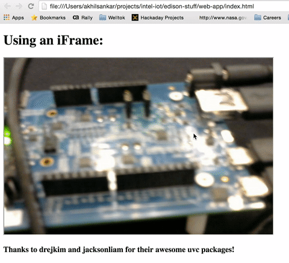

# edison-stuff

##Goal

  Stream video from a Logitech webcam from my Edison to a personal webpage.

##Requirements

  - Intel Edison (I had the expansion board as well)
  - UVC camera

##Setting Up the Edison

  - I ran through the steps to setup the board from here (https://software.intel.com/en-us/get-started-edison-osx-step2)
  - I cloned the edi-cam repo (https://github.com/drejkim/edi-cam) to my Edison, and ran through the setup for the UVC drivers (this should come pre-installed by running the latest versions of the integrated installer)
  - To quickly get the stream up and running, I didn't run the demo on edi-cam. Instead, I ran through the setup steps for the mjpg-streamer (https://github.com/jacksonliam/mjpg-streamer). This spins up a server at the ipaddress of your Edison.
    - To spin up the server, I ran this command from inside mjpg-streamer-experimental: `./mjpg_streamer -i "./input_uvc.so -d /dev/video0 -r 640x480 -f 15" -o "./output_http.so p 9000 -w ./www"`
  - Finally, I was able to get the stream of the video on a local webpage through an iframe with this source: "http://10.0.0.18:8080/?action=stream"

##Progress So Far

  - This is the iframe I've been able to display so far: 
